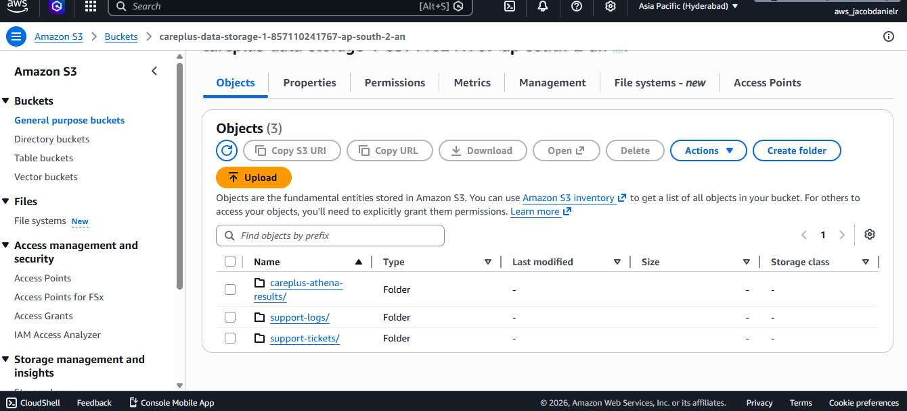
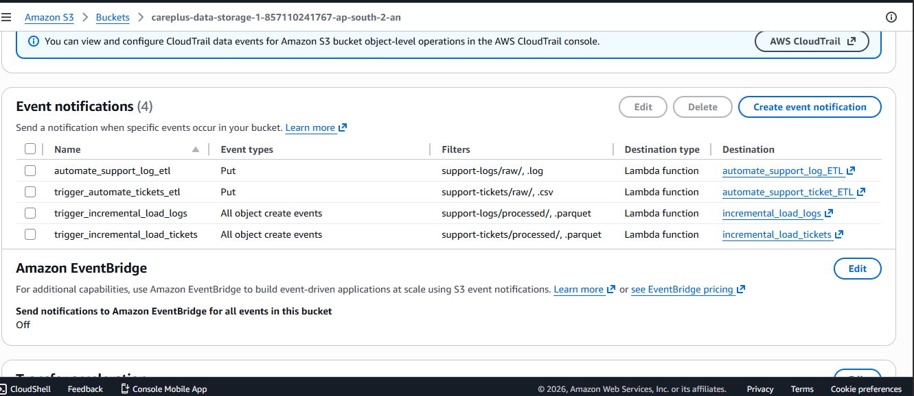
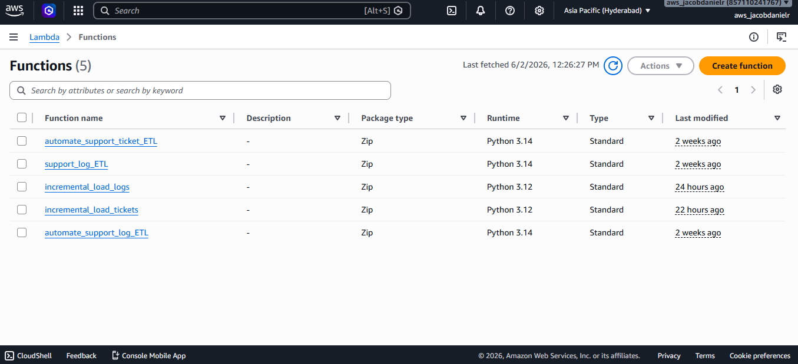
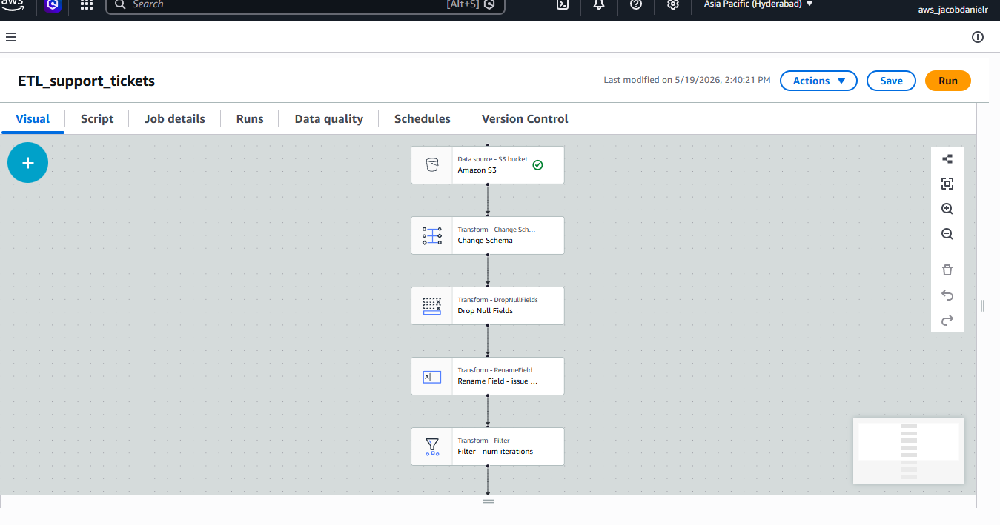
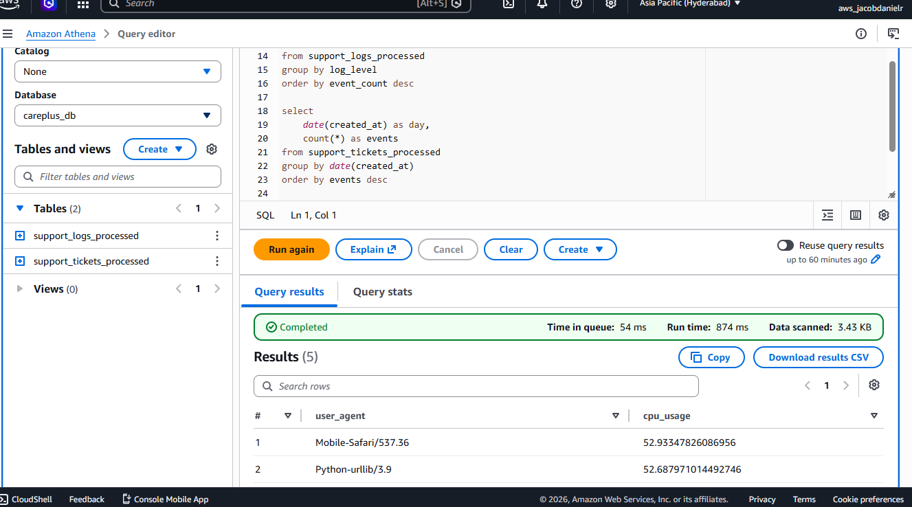
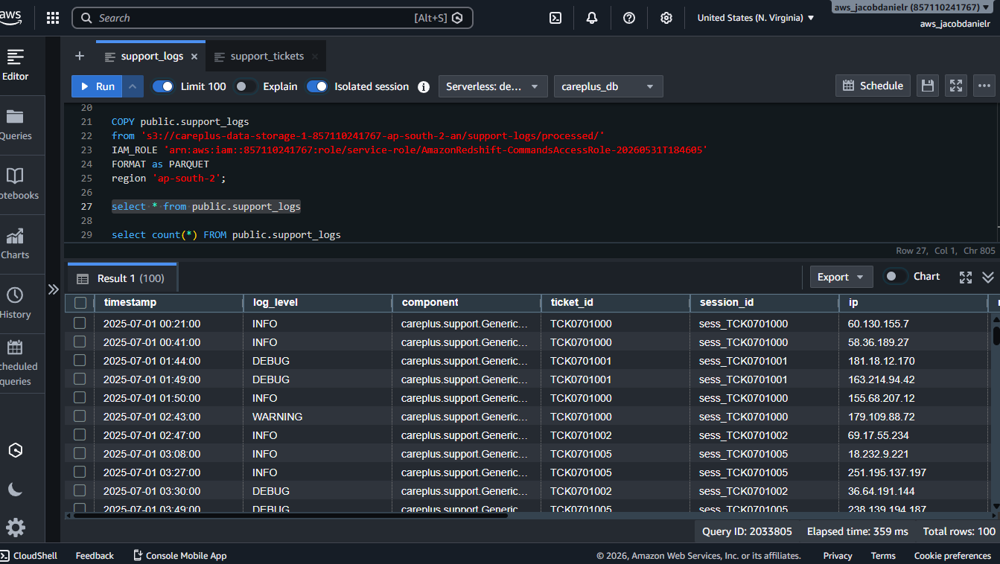
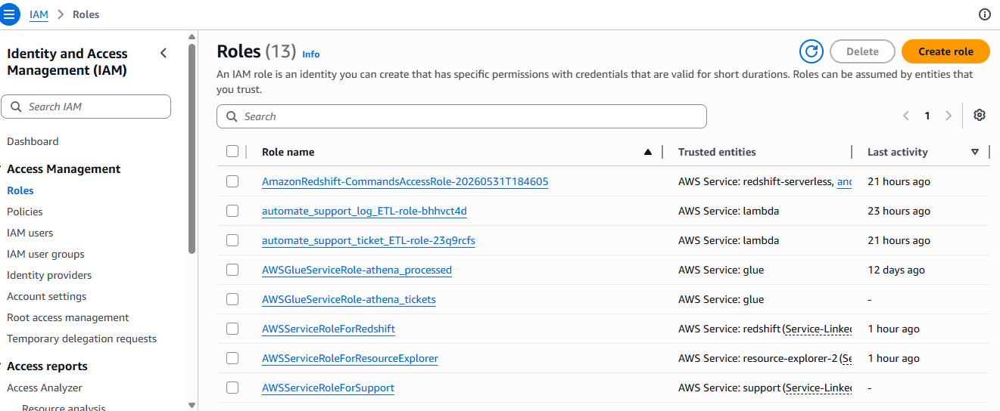
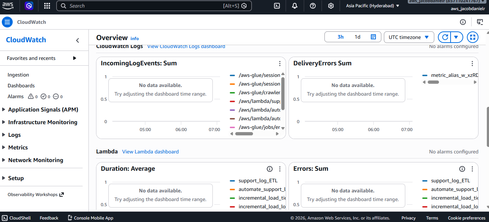

# Project Screenshots

This folder contains screenshots captured during the development and execution of the **CarePlus Support Analytics Pipeline**.

The images provide visual evidence of the AWS services, configurations, automation workflows, and monitoring components used throughout the project.

---

# Screenshot Overview

| Screenshot           | Description                                                                    |
| -------------------- | ------------------------------------------------------------------------------ |
| athena_querying.png  | Querying and validating processed datasets using AWS Athena                    |
| cloudwatch_logs.png  | Monitoring pipeline execution and troubleshooting using Amazon CloudWatch Logs |
| glue_visual_etl.png  | AWS Glue Visual ETL workflow used for support ticket transformation            |
| iam_roles.png        | IAM roles and permissions configured for AWS services                          |
| lambda_functions.png | AWS Lambda functions used for transformation and incremental loading           |
| redshift_editor.png  | Amazon Redshift Serverless tables and SQL operations                           |
| s3_bucket.png        | Amazon S3 bucket structure containing raw and processed data zones             |
| s3_events.png        | S3 Event Notification configuration used to trigger automated workflows        |

---

# Amazon S3 Data Lake

The project uses Amazon S3 as the central storage layer.



The bucket is organized into:

```text id="c7yyb8"
support-logs/
├── raw/
└── processed/

support-tickets/
├── raw/
└── processed/
```

This structure separates incoming raw data from transformed analytics-ready datasets.

---

# Event-Driven Automation

Amazon S3 Event Notifications are used to automate the pipeline.



Whenever a new file arrives in the S3 Raw or Processed zones, an event is generated which triggers the appropriate AWS Lambda function.

This removes the need for manual execution and enables automated processing.

---

# AWS Lambda Functions

AWS Lambda is used extensively throughout the project.



Lambda functions are responsible for:

* Support log transformation
* Triggering AWS Glue jobs
* Incremental loading into Amazon Redshift
* Orchestrating automated workflows

The serverless architecture allows the pipeline to react automatically to incoming data.

---

# AWS Glue ETL

AWS Glue is used for transforming the support ticket dataset.



The project initially used the AWS Glue Visual ETL interface to design and validate transformations before converting the workflow into an automated script-based ETL job.

---

# AWS Athena

AWS Athena was used to validate processed datasets before loading them into the warehouse.



AWS Glue Crawlers were configured to scan the processed Parquet files stored in Amazon S3 and create queryable tables.

Athena was then used to:

* Verify transformed data
* Run exploratory SQL queries
* Validate schema correctness
* Perform quality checks

---

# Amazon Redshift Serverless

Amazon Redshift serves as the project's analytical warehouse.



Processed datasets are incrementally loaded into Redshift using automated Lambda functions and SQL COPY operations.

The warehouse acts as the primary data source for reporting and dashboarding.

---

# IAM Roles & Permissions

AWS IAM was used to configure secure access between services.



IAM roles were configured to allow:

* Lambda access to S3
* Lambda access to Redshift
* Glue access to S3
* Athena access to processed datasets
* Cross-service communication

This provided hands-on experience with AWS security and access management concepts.

---

# Monitoring with CloudWatch

Amazon CloudWatch Logs was used to monitor and troubleshoot pipeline execution.



CloudWatch provided visibility into:

* Lambda execution logs
* Transformation status
* Error messages
* Incremental loading operations
* Pipeline health monitoring

This made it easier to validate successful execution and identify issues during development.

---

# End-to-End AWS Services Used

The screenshots collectively demonstrate the major AWS services used in the project:

* Amazon S3
* AWS Lambda
* AWS Glue
* AWS Glue Crawlers
* AWS Athena
* Amazon Redshift Serverless
* Amazon CloudWatch
* AWS IAM

Together, these services form a fully automated cloud-based data engineering pipeline that ingests, transforms, warehouses, and visualizes customer support data.

